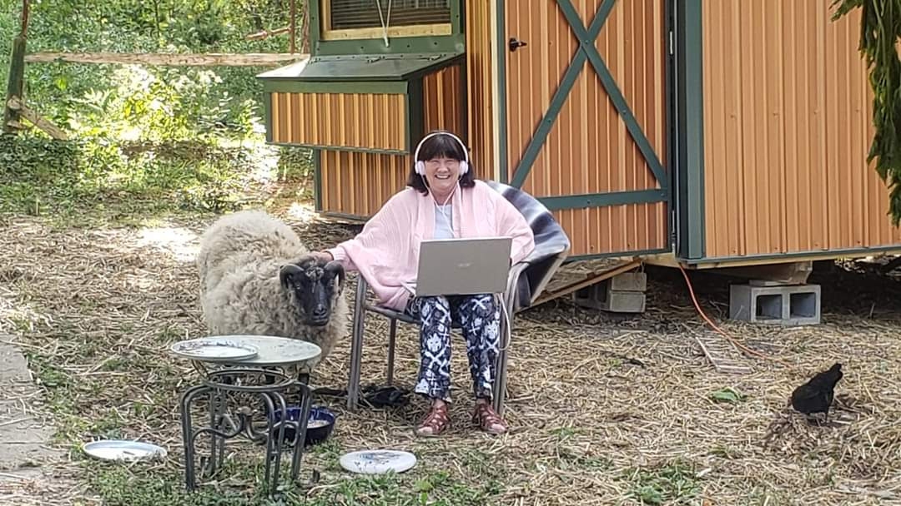
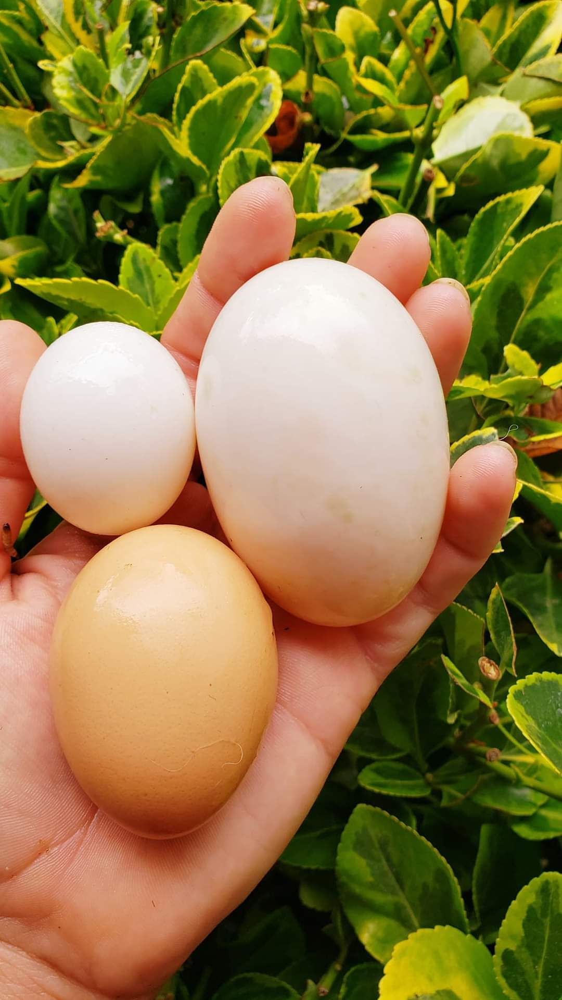
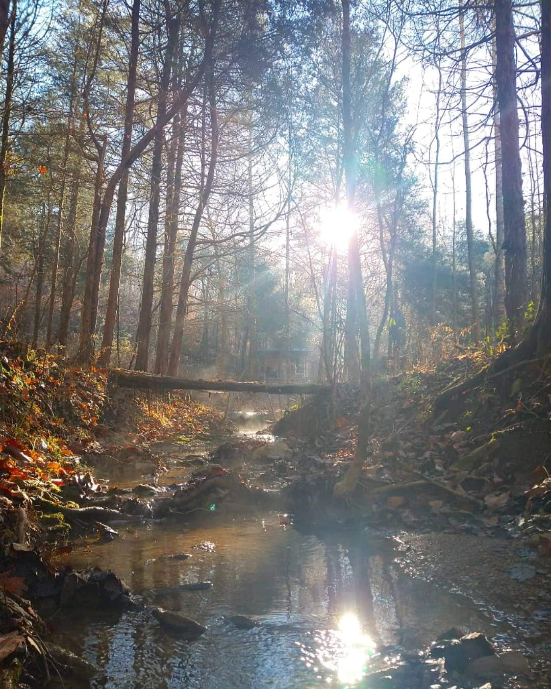

HEYA!
Welcome to the
# rock bottom holler
website. A simple site to connect. 
### Our adventure statement:
We are a family ran homestead practicing old and new ways of living and seeing just how self-sustainable we can get. 2023 we will be implementing a practice called rammed earth in the form of a green house! If successful new living quarters will be built the same way. Here are all of the connecting links if you would like to come and join our family in learning some sweet sh*t

<table>
  <tr>
<!--   Replace the # with the links below.   -->
    <td><a href="https://youtube.com/whatever">YouTube</a></td>
    <td><a href="#">TikTok</a></td>
  </tr>
  <tr>
    <td><a href="#">Facebook</a></td>
    <td><a href="https://wwoofusa.org/en/host/22048-homestead-orchard-permaculture-livestock-natural-building-bees">Woof</a></td>
  </tr>
</table>

<table>
  <tr>
    <td></td>
    <td></td>
    <td></td>
  </tr>
  <tr>
    <td></td>
    <td></td>
    <td></td>
  </tr>
  <tr>
    <td></td>
    <td></td>
    <td></td>
  </tr>
  <tr>
    <td colspan="3"></td>
  </tr>
</table>
